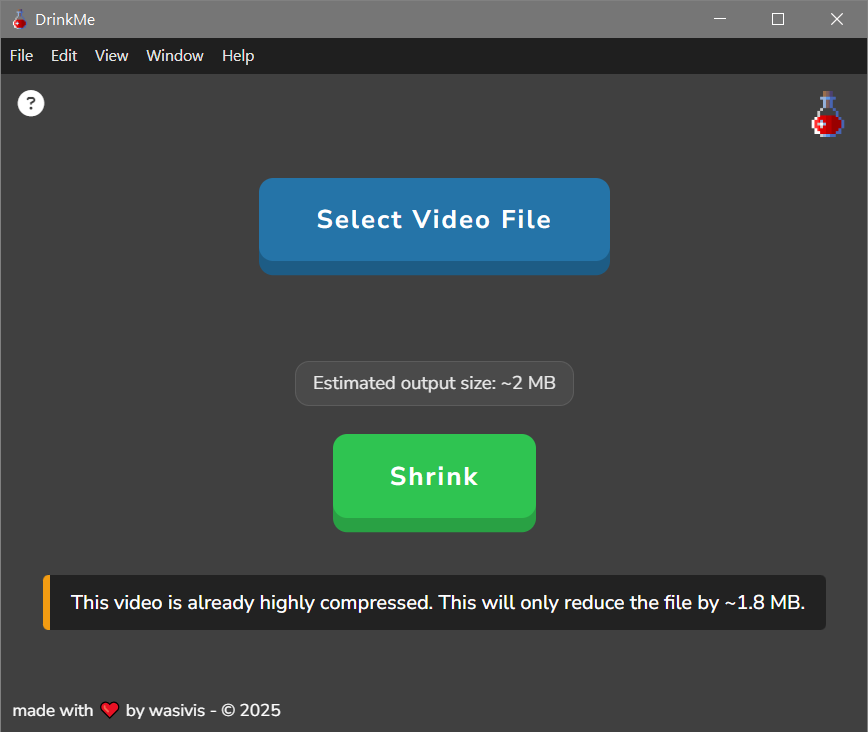

#  DrinkMe

## ☕ Support my work

If you find DrinkMe useful and want to support future updates, a coffee goes a long way 💜

---

## Table of Contents

- [Overview](#overview)
- [Features](#features)
- [Screenshots](#screenshots)
- [Download & Installation](#download)
- [Usage](#usage)
- [Acknowledgments](#acknowledgments)
- [License](#license)

---

## 📘 Overview

DrinkMe is a minimalist desktop app that **automatically compresses** videos into smaller files—no manual settings or technical know-how required. Just pick a file, click **Shrink**, and save space. Although it varies depending on each file, it aims at reducing between 80-90% of the original size.

---

## 🪄 Features

- ✂️ Two-button workflow — select a file, press shrink
- 📦 FFmpeg integration — bundled binaries, no separate install needed
- 🔎 Automatic analysis — estimates disk savings before compressing
- ⚠️ Smart safeguards — skips compression for negligible savings, low disk space, or duplicate outputs
- 📼 Broad format support — handles virtually any common video type
- ⚙️ Portable & installer versions — zero-install EXE or full setup

---

## 🖼️ Screenshots

<table>
  <tr>
    <td align="center">
       
      <em>Select a video, review the estimate, then click Shrink.</em>
    </td>
    <td align="center">
       
      <em>You’ll get a heads-up when only a few megabytes are saved.</em>
    </td>
  </tr>
</table>

---

## 💾 Download and Installation

##### 📦 <u>Portable Version</u>

- Download the _.exe_ file from the Releases page
- Double-click it to launch

##### 🛠️ <u>Installable Version</u>

- Download the latest _DrinkMe Setup x.x.x_
- Choose your preferred install directory during setup
- Use the desktop or Start Menu shortcut to launch

---

## ✂️ Usage

1️⃣ Launch **DrinkMe**.

2️⃣ Click **Select File** and choose your video.

3️⃣ Click **Shrink**.

4️⃣ Your compressed file will appear next to the original in the same folder.

---

## 🙏 Acknowledgments

DrinkMe uses:

- [Electron](https://www.electronjs.org/)
- [FFmpeg](https://ffmpeg.org/) — licensed under LGPL/GPL
- [ffmpeg-static](https://www.npmjs.com/package/ffmpeg-static)
- [ffprobe-static](https://www.npmjs.com/package/ffprobe-static)

---

## 📜 License

DrinkMe is licensed under the [MIT License](LICENSE), with additional terms restricting use of the DrinkMe name and branding assets.

If you fork or reuse this code, please credit the original author and avoid using DrinkMe’s name or visuals unless given permission.
